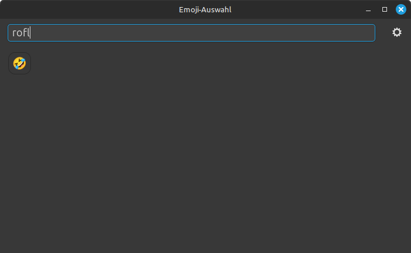

# 👻 Emoji-Picker v1.1.0

Ein schneller, einfacher Emoji-Picker für Linux (GTK-basiert, in Rust geschrieben).

## 💡 Features

* 🔎 Schnelle Live-Suche nach Emojis via Stichworte
* 📑 Kategorien über Tabs organisiert
* 📥 Klick oder Enter kopiert Emoji direkt in Zwischenablage
* ⚙️ Einfache Konfiguration über das Einstellungsmenü
* ⌨️ Aufrufbar per Tastenkombination (Super+.)
* ✅ Erstkonfiguration beim ersten Start
* 🚀 Leichtgewichtig & ohne unnötige Abhängigkeiten

---

## 📸 Screenshots

### Hauptfenster


### Suchfunktion aktiv



### Optionsmenü


---

## 🔧 Installation

### .deb-Paket (empfohlen für Debian, Mint, Tuxedo, Ubuntu):

```bash
sudo apt install ./emoji-picker_1.1.0_amd64.deb
```

### 💻 Manuell kompilieren:

```bash
git clone https://github.com/kai-thanner/emoji-picker.git
cd emoji-picker
cargo build --release
```

Die fertige Binärdatei liegt dann in `target/release/emoji-picker`

---

## ⚙️ Konfiguration & Einstellungen

Beim ersten Start wird unter `~/.config/emoji-picker/settings.ini` automatisch eine Datei erzeugt:

```ini
[Allgemein]
setup_erledigt = true          Legt fest ob Setup beim ersten Start ausgeführt wurde
fenster_schliessen = true      Legt fest ob das Fenster nach auswahl eines Emojis automatisch geschloßen wird
fenster_offen_bei_drag = true  Legt fest ob das Fenster bei Drag und Drop offen bleibt um mehrfach Emojis zu ermöglichen
emoji_size = 20                Größeneinstellung der Emojis
```
Die Werte lassen sich dort oder im UI jederzeit anpassen.

---

## ⌨️ Tastenkombination einrichten

Falls beim ersten Start keine Tastenkombination gesetzt wurde:
getestet unter: Linux Mint 22.1 Cinnamon, Xfce, Mate, Kde, Gnome
Manuelle Konfig nötig: Mate & Kde

```bash
emoji-picker --setup	Alternativ im UI -> Einstellungen
```

Diese legt die tastenkombination Super+. für den Emoji-Picker an.

---

## 📂 Speicherorte

| Datei/Ordner                                             | Beschreibung                    |
| -------------------------------------------------------- | ------------------------------- |
| `/usr/bin/emoji-picker`                                  | Ausführbare Datei               |
| `/usr/share/applications/emoji-picker.desktop`           | Eintrag im Startmenü            |
| `/usr/share/icons/hicolor/_x_/apps/emoji-picker.png` 	   | Icons 16x16 - 512x512           |
| `/usr/share/emoji-picker/`                               | .css Datei für GUI-Fenster      |
| `/etc/emoji-picker/`                                     | .list-Dateien als Vorlage       |
| `~/.config/emoji-picker/`                                | Nutzerdaten (Symbole, Settings) |

---

## 👨‍⚖️ Lizenz

Dieses Projekt steht unter der MIT-Lizenz. Siehe [LICENSE](LICENSE).

## 👨‍💻 Entwickler

> Erstellt von Kai Thanner
